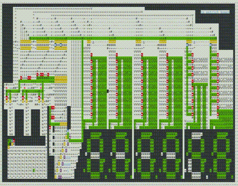
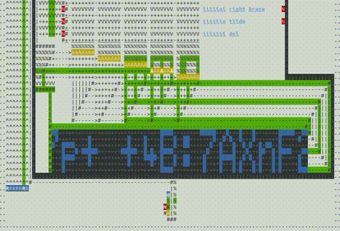
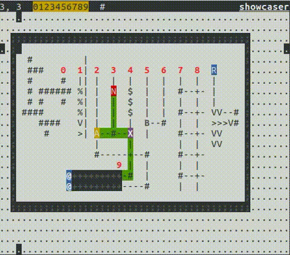

# CCircuit
### Linux C++ Terminal Basic Circuit Simulator

This is a simple circuit simulator, including building blocks such as wire, bridge, AND/XOR/NOT, flip-flops, timers, copy-paste, undo-redo, and more.

(To reduce GIF size: Sped up x2, 4 FPS)

Note: if you are actually crazy enough to try and compile this for your machine, and use it, you'll have to convert all the controls from Dvorak to Qwerty (I'll add a bilingual option, one day), and just a heads up: it automatically gzip loads/saves :)

It even works on Android! Just replace the gzip provider to BusyBox
